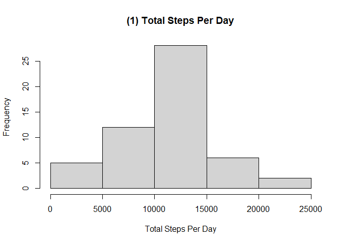
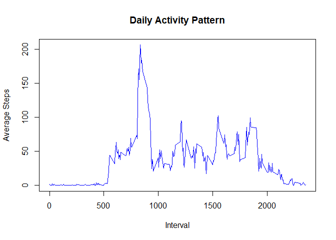
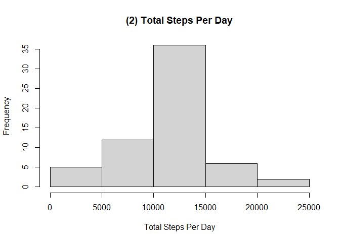

## Loading and preprocessing the data

```r
dt <- read.csv("activity.csv")
str(dt)
```

```
## 'data.frame':	17568 obs. of  3 variables:
##  $ steps   : int  NA NA NA NA NA NA NA NA NA NA ...
##  $ date    : chr  "2012-10-01" "2012-10-01" "2012-10-01" "2012-10-01" ...
##  $ interval: int  0 5 10 15 20 25 30 35 40 45 ...
```

```r
summary(dt)
```

```
##      steps            date              interval     
##  Min.   :  0.00   Length:17568       Min.   :   0.0  
##  1st Qu.:  0.00   Class :character   1st Qu.: 588.8  
##  Median :  0.00   Mode  :character   Median :1177.5  
##  Mean   : 37.38                      Mean   :1177.5  
##  3rd Qu.: 12.00                      3rd Qu.:1766.2  
##  Max.   :806.00                      Max.   :2355.0  
##  NA's   :2304
```

## What is mean total number of steps taken per day?

```r
## Calculate the total steps per day
dt2 <- aggregate(steps ~ date, dt, sum, na.rm=TRUE)

# Plot histogram of total steps per day
hist(dt2$steps, main="(1) Total Steps Per Day", xlab="Total Steps Per Day", ylab="Frequency")
```

<!-- -->

```r
# Total mean and median steps per day
mean_steps <- format(mean(dt2$steps, na.rm=TRUE), digits=2, nsmall=2) # 2 decimal places
median_steps <- median(dt2$steps, na.rm=TRUE)
```
- The mean steps per day is 10766.19 and the median steps per day is 10765


## What is the average daily activity pattern?


```r
## group data set by interval and calculate the mean steps
dt3 <- aggregate(steps ~ interval,dt, mean, na.rm=TRUE)

## rename "steps" to "avgsteps" 
colnames(dt3) <- c("interval", "avgsteps")


## Plot a line graph of Average Steps against Interval
plot(dt3$interval, dt3$avgsteps, type="l", col="blue", xlab="Interval", ylab="Average Steps", 
     main="Daily Activity Pattern")
```

<!-- -->

```r
## get the interval with the highest average steps

## sort by descending order of average steps and get the interval of first row which is the highest number of steps
dt4 <- dt3[order(dt3$avgsteps, decreasing=TRUE),]
high_int <- dt4[1,"interval"]
```
- The 5-minute interval with the maximum number of steps is 835 

## Imputing missing values


```r
## the total number of row missing values in the data set
isna <- NROW(dt[is.na(dt$steps),])

## Imputing strategy: Take all rows not NA and combine with rows NA where NA replaced by the mean in the interval 

## save all rows with na steps
dt_na <- dt[is.na(dt$steps),]

## names(dt3) ==> "interval" "avgsteps"
## names(dt_na) ==> "steps"    "date"     "interval"
## horizontal merge by "interval" column to get the average steps for the interval from dt3
dt_mg <- merge(dt_na,dt3, by.x="interval", by.y="interval", all=TRUE)

## names(dt_mg) ==> "interval" "steps"    "date"     "avgsteps"
## remove the steps column as it contains all NA values
dt_mg <- subset(dt_mg,select=-c(steps))

## rename avgsteps to steps column to make it consistent with the original columns 
colnames(dt_mg) <- c("interval","date","steps")

## filter all rows with not NA steps from original data set
dt_notna <- dt[!is.na(dt$steps),]

## combine rows not NA with the rows with average steps replaced for NA
dt_all <- rbind(dt_notna,dt_mg)

## Get the new steps per day
dt_all2 <- aggregate(steps ~ date,dt_all, sum)

# Plot histogram of total steps per day
hist(dt_all2$steps, main="(2) Total Steps Per Day",xlab="Total Steps Per Day", ylab="Frequency")
```

<!-- -->

```r
# Total mean and median steps per day
mean_steps2 <- format(mean(dt_all2$steps), digits=2, nsmall=2) # 2 decimal places
median_steps2 <- format(median(dt_all2$steps), digits=2, nsmall=2)
```
- The number of rows with NAs number of steps is 2304
- The mean steps per day is 10766.19 and the median steps per day is 10766.19

The values do not differ a lot from the first estimates.  Imputing did not cause a noticeable change in the shape of the histogram but has somehow increased the frequency of steps in the range 10000-15000 Steps Per Day.


## Are there differences in activity patterns between weekdays and weekends?


```r
## make a copy of the data set with the NA filled with the mean of the interval 
w <- dt_all

## get the weekday corresponding to the date in "day" column
w$day <- weekdays(as.Date(w$date), abbreviate=TRUE)

## calculate the factor column of weekday or weekend
w$cat <- ifelse( w[,"day"] %in% c("Sat","Sun"),"Weekend","Weekday")

## Mean steps grouped by factor column and interval
ag2 <- aggregate(steps ~ cat + interval, w, mean)

library(ggplot2)

## create a line panel plot per factor
g <- ggplot(ag2,aes(interval,steps))
g + facet_grid(.~cat) + geom_line(aes(color=cat), size=1) +
  labs(title="Average Steps per Interval", color="Legend") +
  labs(y="Average Steps",x="Interval") 
```

<!-- -->

The peak average steps was achieved during weekday.  But there was a better average steps for the weekend than for weekday for interval range 1000 - 1750.
